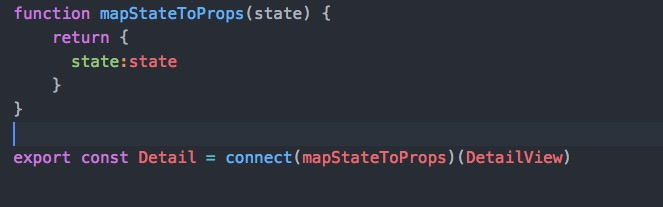

#react+router+redux+webpack实现的全能简单的webApp脚手架

``1 npm install``

``2 node server或者 npm run start``

``3 打开浏览器 输入 localhost:3200``

``如果想将redux中保存的属性引入到页面中  我们可以这样使用     这样操作结束之后我们就可以在页面中直接使用this.props.state进行查看以及使用这个存储在redux中的值``

